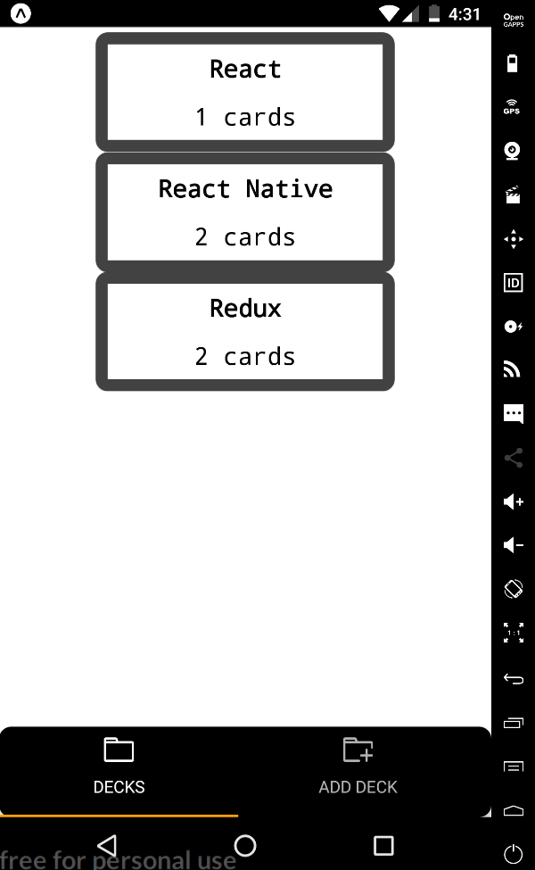
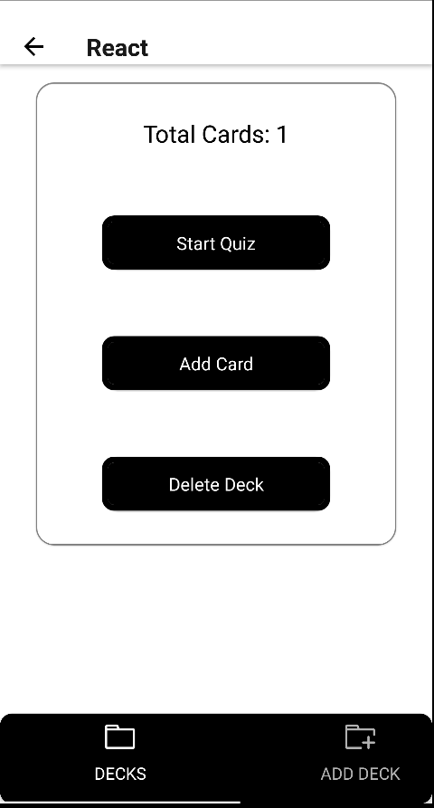
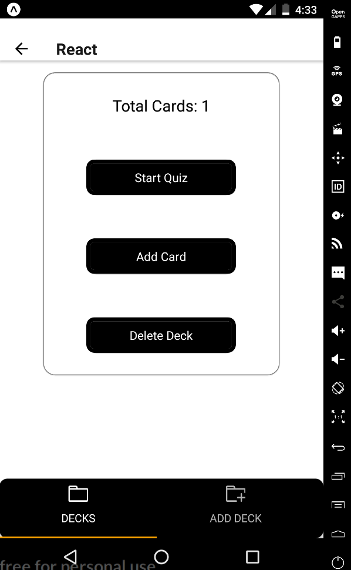
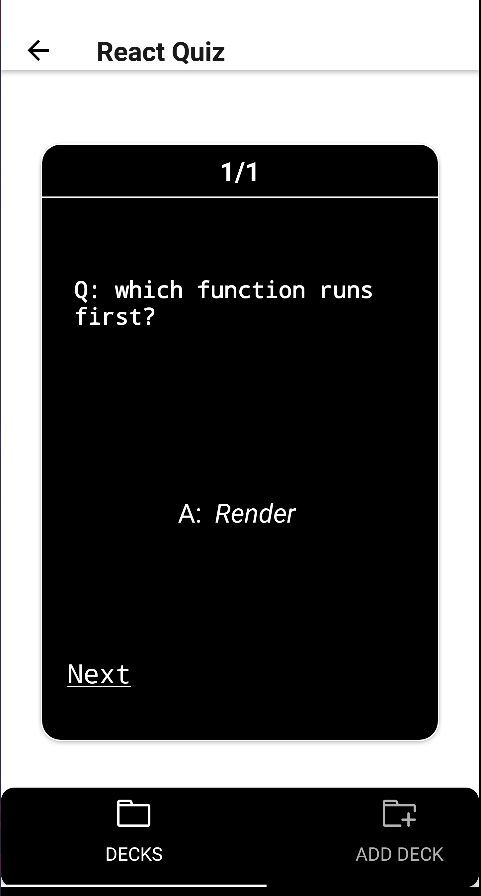
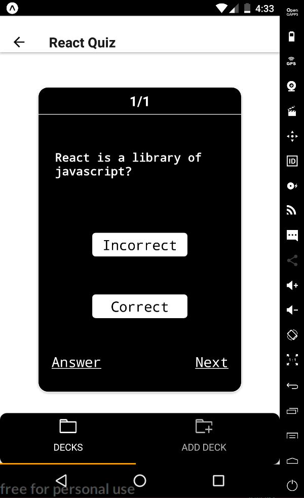
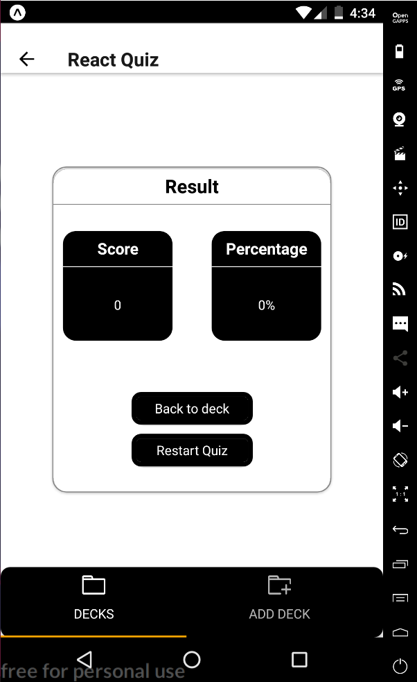

# Mobile Flashcards App
The Mobile Flashcards app is a basic digital flashcard system. You can create decks and cards. Decks are a collection of cards. A card consists of a single question and answer.

## Installation

### Requirements
To run this project, you must first have an android with the [Expo App](https://play.google.com/store/apps/details?id=host.exp.exponent&hl=en) installed or have a computer running android studio with Visual Studio Code installed.  

### Installing Dependencies
In a terminal window, navigate to the project and execute the following commands:
    - `npm install`
    - `expo start`

After the server has started, hit `a` to run it through the android emulator or `d` to display a QR code to view the app on your android through the Expo App.

# How to use app:

## Decks Tab
When the app first loads you will be presented with the Decks screen which will display a list of all of your Decks. If this is your first time using the app, you should be see the message `No Decks avaiable.`.

## Add Deck Tab
To create a new deck, click the `Add Deck`, button at the bottom right corner. You will be presented with dialog box. Enter the title of your new deck, and press `Submit`.

## Deck View
After creating a deck, you will be taken to the Deck view. It is also possible to get to the Deck view from clicking on the desired deck from the Decks view. From the deck view, you will see a num of all of the cards create for the current deck.

## Add Card
To create a new card, click on the plus `Add Card` button. You will be taken to the Add Card view. Here you will be able asked to provide a question and an answer. Clicking the `Submit` button will save the card to the deck and open Deck View again.

## Start Quiz
A quiz is the process of reviewing each card in a specific deck. To take a quiz, click the `Start Quiz` button on the Deck view.

Each question is displayed one at a time. After a guess at the answer has been made, you can indicate whether or not your guess was correct using the correct, or incorrect buttons. The answer to each question can be displayed using the `Answer` button. Clicking next btton will display the next question.

## Result

After all the cards have been presented, your final score will be displayed. From there you will be able to return back to the Deck view or Restart the Quiz.

### Deleting a Deck
If you wish to delete a previously created deck and all the associated cards, click on the desire deck and click the "Delete" button.

### Notifications
If notifications permissions are granted, a daily reminder will be set to alert you everyday at 9:00 AM if you have not completed a quiz.

